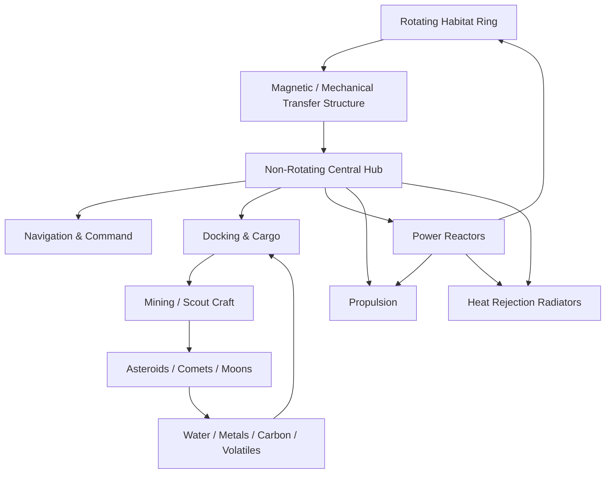
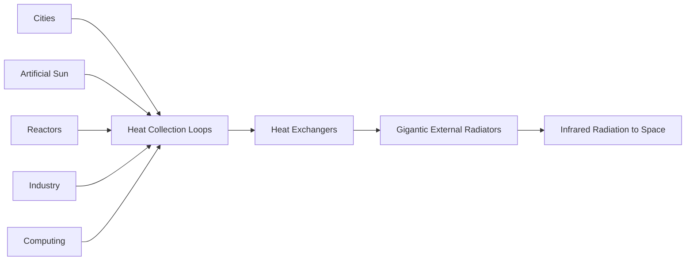
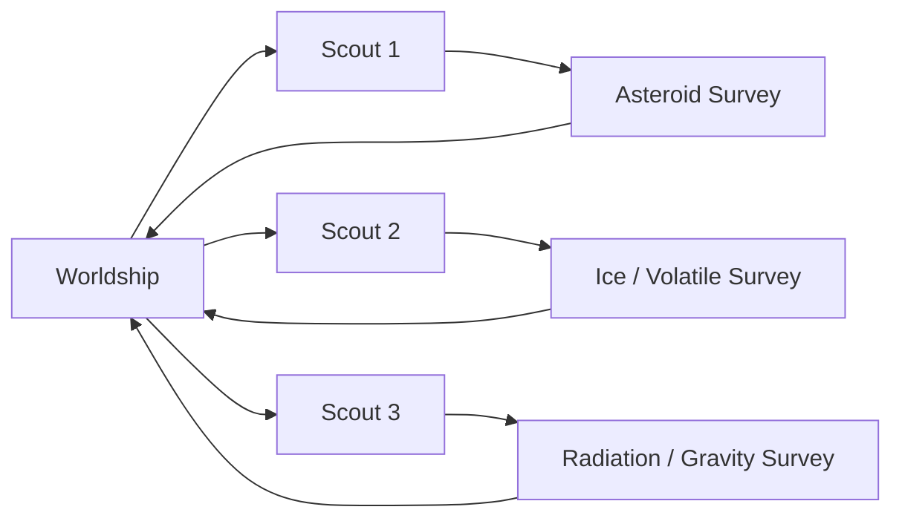

# Ring Worldship Research & Feasibility Study

> **Project type:** Artificial rotating world / mobile space habitat / generation ship  
> **Research status:** Concept engineering study  
> **Last updated:** 18 August 2026  
> **Important:** This document deliberately separates established physics from speculative technology. A rotating artificial world is compatible with known physics; a practical FTL warp/jump drive is not currently demonstrated.

---

## 1. Executive Summary

The central concept is a **closed, rotating ring-shaped worldship**: a very large spacecraft whose inhabited inner surface rotates to create Earth-like apparent gravity, while a separate non-rotating service structure carries propulsion, reactors, docking systems, radiators, navigation, mining logistics, and other infrastructure.

The worldship would not need to remain near Earth or even near a star. It could carry its own:

- atmosphere;
- water cycle;
- farms and food systems;
- artificial daylight;
- power generation;
- thermal-control system;
- factories and recycling;
- radiation and impact shielding;
- propulsion;
- fuel and raw-material reserves;
- autonomous mining craft;
- emergency habitats;
- navigation and astronomical observatories.

The long-term objective is **not “free energy.”** The objective is **resource independence from Earth**. The ship would gather matter and energy from stars, asteroids, comets, moons, and other accessible resources, process those materials onboard, and recycle as close to 100% as practical.

### High-level feasibility

| Feature | Status | Assessment |
|---|---|---|
| Rotating habitat producing ~1 g | 🟢 Known physics | Feasible in principle |
| Sealed Earth-like atmosphere | 🟢 Known engineering principles | Scale and reliability are hard |
| Artificial day/night and sunlight | 🟢 Known physics/technology | Requires enormous electrical/thermal capacity |
| Water recycling | 🟢 Demonstrated in spacecraft | ISS has demonstrated ~98% recovery |
| Fully closed ecosystem for centuries | 🟠 Unsolved | Major biology/reliability research required |
| Asteroid/moon resource harvesting | 🟡 Early-stage technology | ISRU is an active research field |
| Large fission power system | 🟢 Physics proven | Worldship-scale deployment is far beyond current systems |
| Practical commercial fusion power | 🟠 Research | Not yet a mature worldship power source |
| Slow continuous electric/nuclear propulsion | 🟢 Known physics | Moving a gigantic habitat requires extraordinary power and reaction mass |
| Interstellar generation ship | 🟠 Physically possible in principle | Extremely difficult and likely very slow |
| Subluminal “warp-like” spacetime solutions | 🟡 Theoretical research | Mathematical papers exist; no device has been built |
| FTL / Star-Trek-style jump drive | 🔴 Not demonstrated | No known practical engineering method |
| Escape after crossing a black-hole event horizon | 🔴 Do not design around this | Known causal physics does not provide an escape route |
| Perpetual/free energy | 🔴 Impossible under known physics | All useful power must come from an energy source |

---

## 2. Core Design Philosophy

The worldship should be treated as a **city, ecosystem, power station, refinery, shipyard, spacecraft, and disaster shelter at the same time**.

A useful design rule is:

> **No single failure should be capable of killing the entire civilization.**

That immediately implies:

1. many independently sealable pressure zones;
2. redundant power grids;
3. redundant life-support loops;
4. multiple reactor groups;
5. isolated agricultural zones;
6. separate water reservoirs;
7. independent emergency shelters;
8. multiple navigation systems;
9. spare manufacturing capacity;
10. physically separated backups of critical data and biological material;
11. autonomous repair robots;
12. multiple propulsion units;
13. no single central computer whose failure disables the ship;
14. lifeboat habitats capable of independent survival.

The project should eventually become a **fleet of habitats**, not one irreplaceable ring.

---

## 3. Proposed Architecture



### Rotating section

Contains:

- homes;
- hospitals;
- forests;
- lakes and reservoirs;
- farms;
- schools;
- laboratories;
- industry appropriate for gravity;
- parks;
- atmosphere;
- artificial sky;
- local emergency shelters.

### Non-rotating or slowly rotating central structure

Contains:

- spacecraft docking;
- low-gravity laboratories;
- navigation sensors;
- long-range telescopes;
- propulsion equipment;
- main reactors;
- propellant storage;
- mining-craft bays;
- radiator connections;
- cargo handling;
- heavy industrial processes better performed outside the habitation ring.

### Why separate the engines from the rotating city?

Attaching giant engines directly to a spinning habitat complicates thrust transfer, vibration, torque, maintenance, and control. A central propulsion spine can push the vehicle while the habitat maintains a controlled spin rate.

The coupling system is itself a major research problem. At enormous scale, ordinary bearings are unlikely to be sufficient; magnetic bearings, distributed load paths, multiple transfer rings, and active control would need investigation.

---

# 4. Artificial Gravity

A rotating habitat can produce apparent gravity using centripetal acceleration:

\[
g = \omega^2 R
\]

where:

- \(g\) = apparent gravitational acceleration;
- \(\omega\) = angular velocity in radians per second;
- \(R\) = habitat radius.

For Earth-normal gravity:

\[
g \approx 9.80665 \text{ m/s}^2
\]

and:

\[
\omega = \sqrt{\frac{g}{R}}
\]

## Example ring sizes

| Ring radius | RPM for ~1 g | Rotation period | Rim velocity | Ideal thin-ring specific-strength demand |
|---:|---:|---:|---:|---:|
| 1 km | 0.946 rpm | 1.06 min | 0.099 km/s | 0.0098 MJ/kg |
| 5 km | 0.423 rpm | 2.36 min | 0.221 km/s | 0.049 MJ/kg |
| 10 km | 0.299 rpm | 3.34 min | 0.313 km/s | 0.098 MJ/kg |
| **20 km** | **0.211 rpm** | **4.73 min** | **0.443 km/s** | **0.196 MJ/kg** |
| 50 km | 0.134 rpm | 7.48 min | 0.700 km/s | 0.490 MJ/kg |
| 100 km | 0.0946 rpm | 10.57 min | 0.990 km/s | 0.981 MJ/kg |
| 500 km | 0.0423 rpm | 23.65 min | 2.214 km/s | 4.90 MJ/kg |
| 5,000 km | 0.0134 rpm | 74.77 min | 7.002 km/s | 49.0 MJ/kg |

The last column is a simplified lower-bound relation for an ideal self-supporting thin ring:

\[
\frac{\sigma}{\rho} \gtrsim v^2 = gR
\]

Real structures need:

- safety factor;
- non-uniform loads;
- pressure loads;
- shielding;
- soil;
- water;
- buildings;
- joints;
- fatigue allowance;
- impact damage allowance;
- repair margin.

Therefore the ideal value is **not** a design rating.

NASA has studied artificial gravity produced by rotating spacecraft and rotating space habitats for decades.[^1][^2]

---

# 5. Why a 10,000 km Halo-Scale Ring Is Not the First Target

A radius of 5,000 km at 1 g requires an ideal specific tensile strength of roughly:

\[
49 \text{ MJ/kg}
\]

before useful payload or safety margin.

A 2026 Nature Communications paper reported macroscopic carbon-nanotube fibres reaching roughly **12.5 GPa tensile strength** and **7.5 MJ/kg specific tensile strength** under optimal conditions.[^3]

That is an extraordinary material result, but still far below what a practical 5,000 km-radius 1-g ring would require once payload, defects, joints, fatigue, and engineering safety factors are included.

Therefore:

> **Start with kilometre-to-tens-of-kilometres scale, not Halo-game scale.**

A 10–20 km radius ring is still enormous but is dramatically less hostile structurally.

---

# 6. Baseline “Worldship V1” Research Target

For further study, use this as a starting—not final—configuration:

| Parameter | Preliminary target |
|---|---:|
| Ring radius | 20 km |
| Apparent gravity | 1 g |
| Rotation rate | ~0.211 rpm |
| Rotation period | ~4.73 minutes |
| Rim velocity | ~443 m/s |
| Habitat type | Fully pressure-enclosed |
| Atmosphere | Earth-like baseline, adjustable |
| Primary normal propulsion | High-power electric / nuclear-electric future architecture |
| Long-term power | Fission initially; fusion if/when practical |
| Supplemental power | Large deployable solar arrays near stars |
| Main resource strategy | ISRU + extreme recycling |
| Warp/jump | Research-only reserved interface |
| Emergency survival | Independent sectors + lifeboat habitats |

The dimensions of the habitable strip, population, land area, ocean fraction, and total mass should be chosen only after structural, ecological, and thermal models are built.

---

# 7. Atmosphere and Pressure Containment

An open-air Halo ring is unnecessarily risky.

A serious worldship should use a **sealed pressure envelope** with internal compartmentation.

## Recommended layers

From outside to inside:

1. sacrificial impact bumper;
2. multi-layer hypervelocity impact shielding;
3. standoff / vacuum layer;
4. radiation shielding;
5. structural load layer;
6. pressure vessel layer;
7. utility/service layer;
8. habitat liner;
9. artificial-sky/light infrastructure;
10. inhabited environment.

NASA’s Whipple-shield approach uses a sacrificial outer bumper to fragment high-speed projectiles before the debris cloud reaches the pressure wall.[^4]

For a worldship, protection would need to be much more extensive than present spacecraft shielding.

---

# 8. Compartmentalisation

The ring must **not** be one giant shared air volume.

Use many pressure sectors:

```text
[Sector 001]--airlock--[Sector 002]--airlock--[Sector 003]
     |                      |                     |
 emergency              emergency             emergency
 shelter                shelter               shelter
```

Each sector should have:

- isolation doors;
- fire suppression;
- local oxygen reserve;
- local water reserve;
- local emergency power;
- COâ‚‚ removal;
- medical supplies;
- structural sensors;
- independent communications;
- emergency food;
- repair drones.

Large districts can still be visually connected using thick transparent pressure windows, display systems, tunnels, or redundant pressure gates.

---

# 9. Artificial Sun, Sky and Climate

Do **not** put a miniature real star inside the ring.

A better solution is an artificial lighting system that reproduces:

- sunrise;
- daylight;
- sunset;
- moonlight;
- star fields;
- seasonal changes;
- spectral requirements for agriculture.

Possible implementations include:

- high-efficiency LEDs;
- laser/light-pipe distribution;
- reflective solar-light channels when near a star;
- localised agricultural lighting;
- large ceiling panels;
- hybrid direct-solar and electrical systems.

The system can deliberately create distinct climates:

| Zone | Example |
|---|---|
| Tropical | High light, warm, humid |
| Temperate | 24-hour day/night, simulated seasons |
| Polar | Lower light and colder |
| Agriculture | Plant-optimised spectral profile |
| Dark ecology | Permanent or long-duration darkness |
| Urban | Human circadian schedule |

### Important missing problem: heat

Nearly all electrical energy used inside eventually becomes heat.

A 100 GW lighting/industrial system eventually means roughly 100 GW of heat that must be transported and rejected unless energy is exported in another form.

That makes thermal engineering one of the most important worldship systems.

---

# 10. Thermal Control: Space Is Not a Freezer

A common misconception is that the cold of space automatically cools a spacecraft.

In vacuum, there is no surrounding air for convective cooling. Spacecraft must move internal heat to external surfaces and radiate it away as infrared energy.

NASA spacecraft use thermal-control hardware including radiators, heat pipes, pumps, coatings, louvers and deployable radiator surfaces.[^5]

## Worldship thermal architecture



Radiators need protection and redundancy because they are large, externally exposed structures.

### Design requirements

- many physically separated radiator fields;
- isolation valves;
- spare panels;
- self-sealing loops;
- deployable and fixed radiators;
- capability to run civilization at reduced power if radiator area is damaged;
- separate high-temperature reactor radiators and low-temperature habitat radiators.

A worldship can be power-rich and still die if it cannot reject heat.

---

# 11. Power Architecture

No single source should power the whole world.

Use a **microgrid-of-microgrids**:

```text
Reactor Group A ─┐
Reactor Group B ─┼── High Voltage Backbone ── Sector Grids
Solar Farm A ────┤
Storage Bank A ──┤
Storage Bank B ──┘
```

Each district should survive temporary separation from the main grid.

## Power sources

### A. Solar

Near a star, deploy very large solar arrays.

At approximately Earth's orbital distance from the Sun, solar irradiance is around 1.36 kW/m² before conversion losses.

Advantages:

- no onboard nuclear fuel consumption while sunlight is strong;
- can power refineries;
- can charge storage;
- can manufacture fuel;
- scalable collecting area.

Problems:

- effectiveness falls approximately with inverse-square distance;
- arrays are fragile;
- interstellar space provides negligible useful starlight;
- heat still has to be rejected.

### B. Fission

Fission is the most credible independent long-duration nuclear option using known reactor physics.

A worldship would need reactor designs far beyond today's space reactors, but the underlying physics is established.

Use:

- many smaller reactor units rather than one irreplaceable reactor;
- physical separation;
- shielded reactor compartments;
- automated maintenance;
- black-start capability;
- long-lived fuel reserves.

### C. Fusion

Fusion is an attractive long-term possibility, but it should **not** be treated as solved technology.

D-T fusion uses deuterium and tritium. Tritium is scarce and a self-sufficient D-T plant would need to breed it, typically from lithium-containing blankets. DOE continues active research on fusion fuel cycles and tritium breeding.[^6]

Possible future chain:

```text
Water -> hydrogen isotope separation -> deuterium
Lithium -> tritium breeding blanket
Deuterium + tritium -> fusion reactor
Fusion -> electricity + process heat + propulsion
```

A worldship design should remain operable even if practical fusion takes much longer than expected.

---

# 12. Energy Storage

Do not attempt to store centuries of civilization-scale power purely in batteries.

Use several storage layers.

### Milliseconds to seconds

- capacitors;
- superconducting magnetic storage;
- flywheel systems where appropriate.

### Minutes to days

- batteries;
- thermal storage;
- pumped/fluid storage inside artificial gravity environments;
- chemical energy.

### Months to centuries

Store **fuel and feedstock** rather than already-generated electricity:

- reactor fuel;
- hydrogen;
- deuterium;
- lithium;
- chemical propellants;
- other future fusion fuels if useful.

---

# 13. “Free Resources” Means Space Resource Harvesting, Not Free Energy

The worldship cannot create matter or energy for nothing.

The realistic goal is:

> **Use resources that do not need to be launched from Earth.**

NASA calls the general approach **In-Situ Resource Utilization (ISRU)**: using locally available space resources to produce useful products.[^7]

Potential resources include:

### Asteroids

- iron;
- nickel;
- silicates;
- carbonaceous material;
- hydrated minerals;
- some volatiles.

### Comets / icy bodies

- water ice;
- carbon compounds;
- other volatiles.

### Moons

- rock;
- metals/minerals;
- polar ice in suitable locations.

### Gas-giant systems

Potential future collection of:

- hydrogen;
- helium;
- other atmospheric gases.

Atmospheric mining near giant planets is very challenging and should be performed by robotic vehicles, not by flying the worldship deep into the gravity well.

---

# 14. Water Is a Strategic Material

Water can serve simultaneously as:

- drinking water;
- agriculture supply;
- industrial feedstock;
- thermal mass;
- radiation shielding;
- fire suppression;
- chemical feedstock.

Electrolysis can split water into hydrogen and oxygen. NASA ISRU research specifically studies extracting extraterrestrial water and using it to produce useful resources, including oxygen/hydrogen.[^8]

The worldship should maintain massive distributed reservoirs instead of one central ocean tank.

---

# 15. Recycling

The industrial objective should be as close as possible to a closed material loop:


Recover:

- metals;
- polymers;
- glass;
- carbon;
- nitrogen;
- phosphorus;
- rare elements;
- electronic components;
- water;
- nutrients.

NASA’s ISS Environmental Control and Life Support System has demonstrated approximately **98% total water recovery**, which is impressive but still means losses exist and machinery needs continuous maintenance.[^9]

A century-scale worldship requires much more than water recycling: it needs **whole-industrial-system recycling**.

---

# 16. Biosphere and Food

This is one of the hardest unsolved sections.

A real artificial world cannot rely indefinitely on cargo resupply.

It needs:

- plants;
- bacteria;
- fungi;
- pollination systems;
- nutrient cycling;
- waste decomposition;
- seed reserves;
- genetic diversity;
- disease surveillance;
- controlled livestock/aquaculture if desired;
- redundancy in crops;
- artificial food production as backup.

## Do not make the aesthetic park the only biosphere

Separate:

1. public ecological areas;
2. industrial agriculture;
3. emergency food production;
4. seed and embryo/genetic archives;
5. quarantined biological research zones.

If a crop disease destroys one farm region, isolated farms elsewhere must survive.

---

# 17. Population and Long-Term Human Health

A centuries-long ship must plan for:

- genetic diversity;
- maternity and neonatal care;
- ageing population;
- epidemics;
- mental health;
- education;
- cultural continuity;
- exercise;
- reproduction policy without coercive abuse;
- disability access;
- medicine manufacturing;
- surgery;
- dental care;
- drug synthesis;
- spare medical equipment.

Artificial 1-g gravity reduces many concerns associated with long-duration microgravity, but a rotating environment also creates Coriolis effects and differing gravity with height.

Large radius helps keep rotation rate low.

---

# 18. Propulsion

A worldship should not behave like a fighter spacecraft.

Its normal strategy is:

> **small acceleration + very long time = large velocity change**

Candidate conventional/future systems include:

- solar electric propulsion;
- nuclear electric propulsion;
- nuclear thermal propulsion for some auxiliary craft;
- very large ion/plasma thrusters;
- fusion propulsion if practical;
- beamed propulsion for some missions.

NASA continues research into high-power nuclear-electric propulsion technologies.[^10]

## Reaction mass still matters

A propulsion system cannot simply push the ship forever without exchanging momentum somehow.

Depending on propulsion technology, the ship may need:

- propellant;
- expelled reaction mass;
- photon momentum;
- interaction with external fields/medium;
- beamed energy from an external source.

A “reactionless” engine should not be assumed unless experimental physics demonstrates one.

---

# 19. Acceleration and the Rotating Habitat

Even if rotational gravity is 1 g, translational acceleration tilts the effective gravity vector.

If forward acceleration is small compared with 1 g, this tilt is small.

But acceleration introduces important structural problems:

- axial load through the ring;
- torque;
- gyroscopic response;
- vibration;
- fluid movement;
- bending modes;
- bearing/control loads.

The ship should accelerate gradually and use active structural control.

A huge spinning ring is a giant gyroscope. Changing its orientation is not trivial.

### Navigation implication

Instead of turning quickly:

- predict routes years ahead;
- precess slowly;
- use distributed attitude-control systems;
- move the propulsion vector carefully;
- avoid unnecessary changes in spin axis.

---

# 20. Interstellar Flight and the Speed of Light

Known relativity does not allow a massive object to accelerate through the speed of light using ordinary motion.

NASA educational material summarizes the relativistic energy problem: the energy required grows without bound as a massive object approaches light speed.[^11]

Therefore conventional interstellar travel remains a generation-ship problem.

Even at:

- 1% of \(c\): nearest-star journeys take centuries;
- 10% of \(c\): nearest-star journeys still take decades, ignoring acceleration/deceleration.

At high fractions of light speed, shielding becomes a severe challenge because even tiny particles carry enormous kinetic energy in the ship frame.

---

# 21. The High-Speed Dust Problem

This is easy to underestimate.

At conventional spacecraft speeds, micrometeoroids already require shielding.

At interstellar velocities, ordinary dust becomes far more destructive.

A high-speed worldship would need:

- long-range radar/lidar;
- forward particle/dust detection;
- thick sacrificial forward shields;
- expendable ice/regolith layers;
- possibly electromagnetic/plasma deflection for charged particles;
- replaceable shield modules;
- a flight path avoiding dense dust clouds;
- autonomous precursor probes.

NASA-linked interstellar-flight studies explicitly identify shielding against the interstellar medium as an important problem for relativistic or near-relativistic concepts.[^12]

For a gigantic ring, the safest interstellar cruise speed may be much lower than science-fiction expectations unless shielding technology improves radically.

---

# 22. Radiation Protection

Threats include:

- galactic cosmic rays;
- solar particle events near stars;
- trapped radiation around some planets;
- reactor radiation;
- high-energy particles generated by impacts;
- radiation from active astrophysical objects.

Useful shielding materials include hydrogen-rich substances, which makes water valuable.

Design:

```text
SPACE
  |
  |  impact bumper
  |  standoff
  |  regolith / structural shielding
  |  water tanks
  |  pressure hull
  |  inhabited zone
```

The worldship should also have very deeply shielded storm shelters.

---

# 23. Magnetic Fields

A planetary-style magnetic field is **not required to make rotational gravity**, but magnetic systems may help with:

- charged-particle management;
- plasma propulsion;
- reactor confinement if fusion is used;
- magnetic bearings;
- power storage;
- some radiation mitigation concepts.

A magnetic field does **not** replace mass shielding against all cosmic radiation or neutral debris.

Do not assume “Earth magnetic field = complete radiation protection.”

---

# 24. Navigation and Early Warning

A worldship needs a continuously updated 3D/4D gravitational and collision map.

Track:

- stars;
- planets;
- dwarf planets;
- moons;
- asteroids;
- comets;
- interstellar objects;
- dust clouds;
- neutron stars;
- black holes;
- stellar remnants;
- radiation sources;
- spacecraft and debris;
- predicted future positions.

### Navigation time horizon

A civilization-scale vessel should plan:

- hours ahead for local collision threats;
- years ahead for system navigation;
- decades ahead for interstellar trajectory;
- centuries ahead for major stellar encounters.

Use independent navigation computers and independently produced solutions.

---

# 25. Black Holes

Black holes do not behave like universal vacuum cleaners. Far enough away, their external gravitational influence behaves according to their mass.

The danger is approaching too close.

Risks include:

- tidal gravity gradients;
- orbital capture;
- accretion-disk radiation;
- relativistic jets in active systems;
- navigation error;
- structural differential loading.

NASA describes the strong tidal and high-energy environments that can occur near black holes.[^13]

## Event horizon rule

The worldship's safety system should establish exclusion zones **far outside** an event horizon.

Under known causal physics, the event horizon is a point of no return for outward signals/material.

Therefore:

> **No mission architecture should depend on escaping after the ship crosses an event horizon.**

---

# 26. Emergency Black-Hole Avoidance

Use multiple response levels:

| Level | Action |
|---|---|
| Green | Normal course |
| Yellow | Massive object detected / monitor |
| Orange | Begin low-thrust correction |
| Red | Maximum safe conventional escape manoeuvre |
| Black | Hypothetical jump system authorised if one exists |

The correct solution is almost always **early detection**, not last-second acceleration.

A tiny course correction made decades before an encounter can shift the ship by an enormous distance.

---

# 27. Warp / Jump Drive — Research Boundary

This section must be labelled clearly so readers do not confuse theoretical relativity papers with demonstrated engineering.

## What exists

General Relativity allows mathematical spacetime geometries described as “warp drives.”

Recent theoretical work has explored:

- constant-velocity subluminal warp solutions satisfying standard energy conditions;[^14]
- positive-energy approaches to steering/accelerating protected cavities under specific assumptions;[^15]
- theoretical interactions between warp geometries and black-hole backgrounds.[^16]

## What does not exist

There is currently no experimentally demonstrated device that can:

- make a macroscopic warp bubble;
- move a spacecraft faster than light;
- jump instantaneously between star systems;
- provide known “warp fuel”;
- safely create and collapse an FTL bubble;
- guarantee causal control of a superluminal bubble;
- escape from inside a black-hole event horizon.

### Project status

```text
WARP POWER INTERFACE: RESERVED
WARP FUEL: UNKNOWN
WARP GENERATOR: NOT INVENTED
FTL CAPABILITY: NOT DEMONSTRATED
```

This is intentionally honest.

---

# 28. If a Future Warp System Is Invented

The worldship can be designed with **interfaces and spare capacity** without pretending the device already exists.

Potential provisions:

- large independent energy reserve;
- structural mounting zones;
- high-capacity superconducting bus;
- isolated experimental compartments;
- external generator ring mounting points;
- emergency shutdown zones;
- field/sensor instrumentation;
- distributed generators rather than a single unit.

A speculative arrangement might use multiple field stations around the craft, but there is currently no physical engineering basis for specifying their number or geometry.

---

# 29. Emergency Warp Philosophy

If a safe practical warp/jump technology is ever discovered:

1. it should not be the only propulsion system;
2. it should not be required for daily survival;
3. it should have independent reserve power;
4. normal propulsion should remain operational;
5. it should never be used without destination verification;
6. it should have multiple abort conditions;
7. it should activate well before an event-horizon encounter;
8. it should not be assumed capable of violating causality merely because fiction depicts it that way.

---

# 30. Resource Scouts

The ring should not blindly arrive at a system hoping to find fuel.

Deploy autonomous scouts years or decades ahead.



Scouts should map:

- mineable water;
- metal content;
- fuel/feedstock;
- navigation hazards;
- radiation;
- safe parking orbits;
- possible scientific targets.

---

# 31. Mining Fleet

The main ring should remain distant from hazardous resource bodies.

Use:

- robotic miners;
- tugs;
- cargo haulers;
- refinery barges;
- fuel tankers;
- prospecting drones.

NASA currently researches ISRU methods including extracting water from extraterrestrial material and processing extraterrestrial metals.[^7][^8][^17]

---

# 32. Refining and Manufacturing

To survive for centuries, the ship needs to manufacture its own:

- structural beams;
- pressure vessels;
- pipes;
- pumps;
- valves;
- motors;
- bearings;
- cables;
- circuit boards;
- sensors;
- computers;
- lenses;
- medical tools;
- agricultural hardware;
- replacement robots.

The difficult part is not simply having a 3D printer.

A complete technological civilization needs supply chains for:

- ultra-pure semiconductors;
- dopants;
- precision optics;
- lubricants;
- catalysts;
- specialty alloys;
- superconductors;
- pharmaceuticals;
- machine tools.

This is a major research topic that is often missing from generation-ship proposals.

---

# 33. Spare Parts and “Factory That Can Build the Factory”

A true independent worldship should eventually contain enough industrial capability to rebuild its own production equipment.

The goal is recursive manufacturing capability:

> **Can the ship manufacture the machines required to manufacture replacement machines?**

Until the answer is yes for critical systems, the ship is not truly independent.

---

# 34. Data, Knowledge and Software Preservation

Store many isolated copies of:

- scientific literature;
- engineering drawings;
- medicine;
- agriculture knowledge;
- navigation catalogues;
- source code;
- manufacturing recipes;
- language/cultural archives.

Use:

- offline cold storage;
- radiation-hardened media;
- geographically separated data centres around the ring;
- error-correcting storage;
- periodic integrity audits;
- printed/physical backups of essential emergency procedures.

A cyberattack or software corruption must not disable life support.

---

# 35. Cybersecurity and Control Safety

Critical control networks should be segmented.

Separate:

- public network;
- research network;
- industrial control;
- reactor control;
- propulsion;
- life support;
- emergency controls.

Provide manual/local fallback for critical mechanical systems where practical.

No entertainment app should be capable of reaching a reactor controller.

---

# 36. Fire Safety

Fire behaves differently depending on gravity, airflow, materials, and pressure.

A worldship needs:

- non-flammable structural interiors;
- smoke zones;
- automatic isolation;
- local suppression;
- fire-resistant cable routes;
- evacuation tunnels;
- backup atmosphere;
- toxic-gas detection.

A large atmosphere makes fire one of the most serious internal hazards.

---

# 37. Disease and Biosecurity

A closed world can amplify disease.

Use:

- distributed hospitals;
- genomic/pathogen surveillance;
- quarantine sectors;
- independent ventilation controls;
- wastewater monitoring;
- vaccine/pharmaceutical manufacturing;
- separate animal/agricultural quarantine.

Agricultural disease must be considered as seriously as human disease.

---

# 38. Structural Health Monitoring

Embed huge numbers of sensors into the ring.

Monitor:

- strain;
- cracks;
- vibration;
- fatigue;
- temperature;
- pressure;
- radiation damage;
- corrosion;
- impact;
- bearing loads;
- alignment.

Use robotic inspection systems continuously.

At this scale, maintenance is not an occasional activity.

**The worldship is always under maintenance.**

---

# 39. Active Structural Control

A gigantic ring will have vibration modes.

Use:

- distributed actuators;
- tuned mass systems;
- active damping;
- controlled fluid movement;
- spin-balancing systems;
- moving counterweights;
- software that limits synchronized crowd/industrial loading if necessary.

Large reservoirs and cargo movement must be coordinated so the rotating mass remains balanced.

---

# 40. Water and Ocean Dynamics

Large open oceans inside a rotating ring are more complicated than putting a lake on Earth.

Research is needed for:

- waves;
- centrifugal free surfaces;
- Coriolis effects;
- slosh during manoeuvres;
- pressure loading;
- floods after sector damage.

Initial generations should favour controlled lakes/reservoirs rather than Earth-scale oceans.

---

# 41. Weather

Weather can be created naturally by internal heating, humidity and circulation, but uncontrolled weather may be undesirable.

The ship can actively manage:

- temperature;
- humidity;
- cloud formation;
- rainfall;
- wind;
- irrigation.

A worldship may deliberately use milder weather than Earth because severe storms add structural and emergency risk.

---

# 42. Agriculture

Use several independent approaches:

- soil agriculture;
- hydroponics;
- aeroponics;
- algae;
- fungal protein;
- fermentation;
- cellular agriculture if mature;
- stored emergency food.

No single crop or food technology should become a single point of failure.

---

# 43. Waste and Nutrient Cycles

Human civilization requires more than oxygen and water.

Track closed-loop inventories of:

- carbon;
- nitrogen;
- phosphorus;
- potassium;
- sulfur;
- trace minerals.

Nutrients lost into inaccessible waste streams must eventually be recovered.

---

# 44. External Communication

Within one solar system, communication experiences light-speed delay.

Between stars, delays become years.

A true interstellar worldship therefore cannot depend on Earth for:

- real-time command;
- emergency troubleshooting;
- government;
- medicine;
- navigation.

It must be operationally autonomous.

---

# 45. Governance and Social Continuity

This is engineering too.

A ship intended to last centuries must define:

- constitutional governance;
- emergency powers;
- maintenance obligations;
- scientific independence;
- succession;
- conflict resolution;
- access to resources;
- safety regulation;
- protection against a single person taking irreversible control.

This is not a justification for authoritarian population control. The point is resilience, rights, and continuity.

---

# 46. Lifeboats and Secondary Habitats

The best disaster recovery plan is to avoid putting all humans in one structure.

Worldship architecture should eventually include:

- main ring;
- independent smaller habitat rings;
- farm habitats;
- industrial habitats;
- emergency shelters;
- transport ships;
- resource depots.

```text
             [Scout]
                o

 [Farm Ring] o     o [Habitat B]

              O
        MAIN WORLDSHIP

 [Industry] o       o [Habitat C]

                o
          [Fuel / Depot]
```

A catastrophic main-ring failure should not mean extinction.

---

# 47. Docking

Never force small spacecraft to match the full rim velocity of the rotating city.

Dock at a central or non-rotating hub.

Then transfer passengers/cargo through:

- spokes;
- elevators;
- rotating transfer stations;
- gradual spin-up systems.

The transition from zero-g to 1-g must be designed carefully.

---

# 48. Construction Strategy

Do not launch a completed worldship from Earth.

Build it in space.

Possible long-term sequence:

### Phase 0 — Ground research

- closed ecosystems;
- ultra-high-reliability life support;
- rotating habitat medicine;
- autonomous manufacturing;
- large space nuclear power;
- advanced materials.

### Phase 1 — Small rotating demonstrator

- 50–200 m;
- months/years of occupation.

### Phase 2 — Large orbital settlement

- ~1 km class;
- independent agriculture;
- in-space maintenance.

### Phase 3 — Asteroid/mining economy

- space refineries;
- autonomous cargo;
- large-scale metal and volatile recovery.

### Phase 4 — Multi-kilometre settlement

- substantial permanent population;
- high material closure.

### Phase 5 — Mobile worldship demonstrator

- very slow propulsion;
- prolonged independent operation.

### Phase 6 — 10–20 km class

- true worldship-scale environment.

### Phase 7 — Interstellar attempt

Only after closed civilization-scale operation has been demonstrated for many decades.

---

# 49. What We Are Still Missing / Major Research Gaps

These are the problems that require serious work before the concept becomes an engineering project.

## Structure

- full finite-element model of a rotating 20 km ring;
- mass distribution;
- fatigue life over centuries;
- crack arrest;
- damage tolerance;
- thrust-transfer structure;
- bearing/coupling system;
- gyroscopic control.

## Atmosphere

- total gas mass;
- pressure-vessel loads;
- compartment size;
- leakage rate;
- nitrogen/oxygen reserves;
- contaminant control.

## Ecology

- stable multi-century nutrient cycle;
- crop diversity;
- disease control;
- soil/microbiome stability;
- emergency food production.

## Thermal

- total waste heat;
- radiator temperature;
- radiator area;
- coolant inventory;
- battle/impact damage resilience.

## Power

- reactor count;
- fuel life;
- maintenance cycle;
- solar collector area;
- storage capacity;
- black-start procedure.

## Propulsion

- total vehicle mass;
- achievable thrust;
- reaction-mass budget;
- acceleration;
- trip duration;
- braking;
- attitude control.

## Radiation

- required water/regolith thickness;
- solar-event shelter design;
- secondary-particle production.

## Impacts

- shielding against local meteoroids;
- shielding against interstellar dust;
- maximum safe cruise velocity.

## Industry

- semiconductor production;
- medicines;
- high-precision machinery;
- lubricants and catalysts;
- raw-element inventory.

## Society

- population needed for industrial skill diversity;
- education;
- governance;
- disaster recovery;
- cultural continuity.

## Warp / jump

- whether physically buildable at all;
- required stress-energy;
- energy scale;
- field generation;
- causal control;
- human safety;
- navigation;
- shutdown;
- interaction with surrounding matter/radiation.

---

# 50. Things the Project Must Not Claim as Established

For scientific honesty, do **not** state the following as facts:

- “We know how to build a warp drive.”
- “Warp only needs enough electricity.”
- “A jump drive can escape a black hole after the event horizon.”
- “Fusion is already a solved worldship reactor.”
- “Asteroid mining is currently cheap/easy.”
- “A closed ecosystem can already support millions of people forever.”
- “Space provides unlimited free energy.”
- “A Halo-scale ring can be built using present structural materials.”
- “Magnetic fields block all space radiation.”
- “Space automatically keeps the ship cold.”

The project becomes stronger, not weaker, by identifying unknowns.

---

# 51. Technology Readiness Summary

## Green — grounded in established physics

- rotation-created apparent gravity;
- pressure vessels;
- solar power;
- fission;
- electrolysis;
- water recycling;
- electric propulsion;
- asteroid/comet resource chemistry;
- robotics;
- radiation mass shielding;
- radiative thermal control;
- compartmentalisation.

## Yellow — plausible but requires major advances

- kilometre-to-tens-of-kilometres rotating habitats;
- civilization-scale closed ecology;
- giant space-based manufacturing;
- large asteroid mining economy;
- worldship-scale nuclear-electric propulsion;
- century-life structures;
- nearly complete industrial material closure;
- practical high-output fusion.

## Red — speculative / not demonstrated

- FTL;
- Star-Trek-style jump;
- practical warp-field generator;
- antigravity;
- reactionless propulsion;
- escaping an event horizon;
- perpetual/free energy.

---

# 52. Recommended Next Engineering Study

The next useful step is to stop changing the overall concept and build a numerical **Worldship V1 mass/energy model**.

Define:

1. population;
2. ring radius;
3. ring width;
4. floor area;
5. atmosphere depth;
6. pressure;
7. structural mass;
8. shielding mass;
9. water inventory;
10. agricultural area;
11. average electrical demand;
12. artificial-light demand;
13. reactor capacity;
14. radiator area;
15. propulsion system;
16. total dry/wet mass;
17. acceleration;
18. route;
19. resource consumption/recycling losses.

Then iterate until the design closes mathematically.

---

# 53. Preliminary Worldship V1 Rules

1. **20 km radius baseline** for study.
2. **1 g rotational gravity.**
3. **Fully enclosed atmosphere.**
4. **Thousands of isolatable pressure/fire sectors.**
5. **Non-rotating central propulsion/service hub.**
6. **No dependence on warp technology.**
7. **Fission-capable base power architecture.**
8. **Fusion treated as future upgrade.**
9. **Solar harvesting whenever near a useful star.**
10. **Asteroid/comet/moon ISRU.**
11. **Distributed water shielding/reservoirs.**
12. **Large replaceable radiators.**
13. **Autonomous resource scouts.**
14. **Continuous structural-health monitoring.**
15. **Multiple independent smaller habitats/lifeboats.**
16. **Early black-hole and stellar-hazard avoidance.**
17. **Warp/jump interface reserved only for future validated physics.**
18. **Never rely on perpetual/free energy.**
19. **Never rely on a single reactor, computer, farm, atmosphere zone, or engine.**
20. **Design every critical system to be repairable with onboard industry.**

---

# 54. Final Verdict

## Can a ring-shaped artificial world exist?

**Yes.** Rotational artificial gravity is compatible with known physics and has been studied for decades.

## Can it become a spacecraft?

**Yes in principle.** Nothing in basic mechanics prevents a rotating habitat from also being translated through space, provided the structure can withstand thrust and control loads.

## Can it carry an artificial Sun?

**Yes, as a lighting system.** A real miniature star is unnecessary and impractical. Artificial daylight is a power and thermal-management problem.

## Can it live without Earth?

**Potentially, but not with current technology at civilization scale.** ISRU, recycling, autonomous industry, and closed ecology would all have to advance enormously.

## Can it travel through interstellar darkness?

**Yes in principle**, if it carries sufficient nuclear/fusion fuel, material reserves, life support, manufacturing capability, and shielding.

## Can it mine “free” resources?

It can harvest natural resources without buying or launching them from Earth, but extraction, transport, refining, and conversion always require energy and machinery.

## Can it have a jump/warp drive?

**Not with demonstrated technology today.** General-relativity research contains interesting warp-like mathematical solutions, including recent positive-energy subluminal work, but this is not equivalent to having a buildable engine.

## Can warp be an emergency escape from a black hole?

Only as a **future hypothetical capability** and only if such a device is actually discovered. The real safety strategy is early detection and conventional course correction. The project should never depend on escaping after crossing an event horizon.

## Is the whole project impossible?

No.

The project contains three different categories:

> **Known-physics systems + extreme future engineering + a clearly isolated speculative warp module.**

That distinction makes the Ring Worldship a useful serious research concept rather than pretending every science-fiction feature already exists.

---

# 55. References

[^1]: NASA Technical Reports Server, *Physics of Artificial Gravity* (2006): https://ntrs.nasa.gov/api/citations/20070001008/downloads/20070001008.pdf

[^2]: NASA Technical Reports Server, *Long Term Human Presence in Space Requires Artificial Gravity and Radiation Shielding* (2023): https://ntrs.nasa.gov/api/citations/20230015107/downloads/Artificial%20gravity%20and%20radiation%20shielding%20charts.pdf

[^3]: Wang, J. N., Chen, Y. T. & Liu, K. F., *Improvement of the tensile strength of carbon nanotube fibers to 12.5 GPa by fluidics-induced alignment and densification*, Nature Communications (2026): https://www.nature.com/articles/s41467-026-75150-1

[^4]: NASA Johnson Space Center Hypervelocity Impact Technology, *Shield Development – Basic Concepts*: https://hvit.jsc.nasa.gov/shield-development/

[^5]: NASA Small Spacecraft Systems Virtual Institute, *Thermal Control* (updated 2026): https://www.nasa.gov/smallsat-institute/sst-soa/thermal-control/

[^6]: U.S. Department of Energy, *DOE Explains…Deuterium-Tritium Fusion Fuel*: https://www.energy.gov/science/doe-explainsdeuterium-tritium-fusion-fuel

[^7]: NASA, *In-Situ Resource Utilization (ISRU)*: https://www.nasa.gov/mission/in-situ-resource-utilization-isru/

[^8]: NASA TechPort, *Water Extraction from Regolith (ISRU)*: https://techport.nasa.gov/projects/93846

[^9]: NASA, *NASA Achieves Water Recovery Milestone on International Space Station* (2023): https://www.nasa.gov/missions/station/iss-research/nasa-achieves-water-recovery-milestone-on-international-space-station/

[^10]: NASA Technical Reports Server, *Technology Maturation Plan for High Power Nuclear Electric Propulsion* (2026): https://ntrs.nasa.gov/api/citations/20260001499/downloads/NEPTMP_SNP-PLAN-0043Ver1_1Baselined.pdf

[^11]: NASA, *Three Ways to Travel at (Nearly) the Speed of Light*: https://www.nasa.gov/solar-system/three-ways-to-travel-at-nearly-the-speed-of-light/

[^12]: Lubin, P., *A Roadmap to Interstellar Flight*, NASA Technical Reports Server (2019): https://ntrs.nasa.gov/api/citations/20200000547/downloads/20200000547.pdf

[^13]: NASA, *What Happens When Something Gets Too Close to a Black Hole?*: https://science.nasa.gov/universe/what-happens-when-something-gets-too-close-to-a-black-hole/

[^14]: Fuchs et al., *Constant Velocity Physical Warp Drive Solution* (2024), arXiv: https://arxiv.org/abs/2405.02709

[^15]: Le, A. T., *Steering a warp drive without exotic matter* (2026), arXiv: https://arxiv.org/abs/2606.22531

[^16]: Garattini, R. & Zatrimaylov, K., *Black Holes, Warp Drives, and Energy Conditions* (2024), arXiv: https://arxiv.org/abs/2408.04495

[^17]: NASA TechPort, *Extraterrestrial Metals Processing* (2026): https://techport.nasa.gov/projects/93477

---

## Notes for Contributors

This repository should welcome calculations, simulations, engineering criticism, and source-backed improvements.

When adding a feature, label it as one of:

- `KNOWN PHYSICS`
- `ENGINEERING UNSOLVED`
- `THEORETICAL`
- `SPECULATIVE`

Do not silently move an idea from speculative to feasible without evidence.

Suggested future contributions:

- Python/Julia/MATLAB ring stress simulator;
- atmosphere mass calculator;
- radiator-sizing model;
- population/food model;
- propulsion delta-v calculator;
- black-hole tidal-force exclusion-zone calculator;
- asteroid resource planner;
- closed-loop material-loss model;
- interactive web visualisation of the worldship.

---

*This document is a concept research study, not a claim that all listed technologies are currently buildable.*
